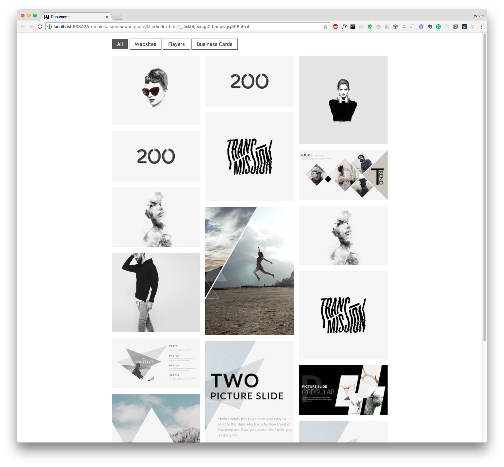

[](https://github.com/professor-severus-snape/filters/actions/workflows/vite_ci-cd.yml)

# Портфолио с фильтрами

Небольшое React-приложение с фильтрацией картинок по категориям.  
Позволяет динамически переключать отображение элементов в зависимости от выбранного фильтра.



## Демо

Посмотреть демо можно [здесь](https://professor-severus-snape.github.io/filters/).

## Возможности

- фильтрация картинок по категориям
- отображение активного фильтра
- динамическое обновление списка картинок
- разделение логики и представления через компоненты
- переиспользуемая архитектура компонентов

## Архитектура компонентов

- `Portfolio` — stateful компонент
  - хранит список картинок в state
  - хранит активный фильтр в state
  - управляет фильтрацией

- `Toolbar` — презентационный компонент
  - отображает список фильтров
  - сообщает о выборе фильтра

- `ProjectList` — презентационный компонент
  - отображает список картинок

## Пример использования

```jsx
<Toolbar
  filters={["All", "Websites", "Flayers", "Business Cards"]}
  selected="All"
  onSelectFilter={(filter) => console.log(filter)}
/>
```

## Технологии

- React 18
  - JSX
  - functional components
  - props
  - useState
  - обработка событий
- типизация - propTypes
- линтинг - ESLint 
- сборка - Vite

## CI/CD

- GitHub Actions - линтинг и сборка проекта (CI)
- GitHub Pages - автоматический деплой приложения (CD)
